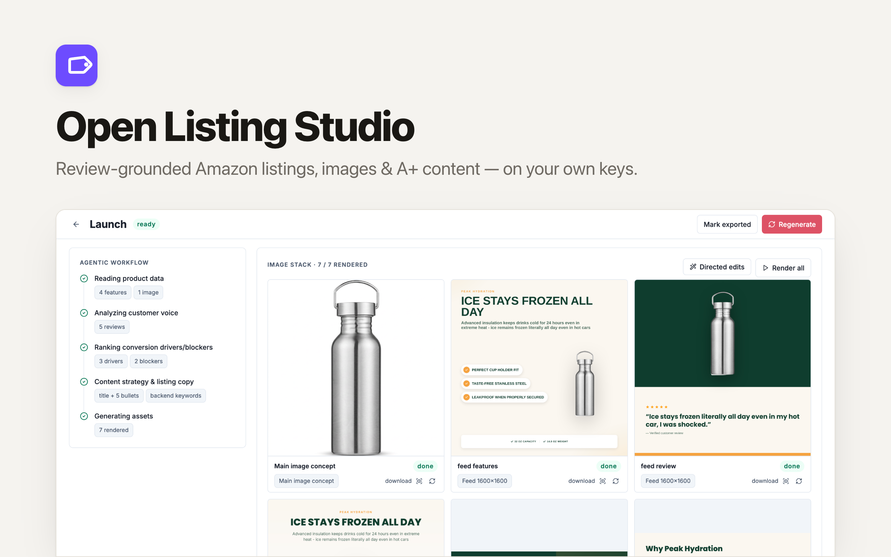

> **Celaya Solutions Research Course Edition.** Start with [COURSE_EDITION.md](COURSE_EDITION.md). Use fake data only.

<p align="center">
  
</p>

# OpenListingStudio

[](https://app.clawnify.com/deploy?repo=clawnify/OpenListingStudio)

**The open-source AI listing studio for e-commerce sellers.** Brand kits, a product library with review ingestion, and a review-grounded **Launch** workflow that generates Amazon-compliant listing copy, a branded product image stack, and A+ content modules — plus directed-edit image tools for product photos. Amazon-first, agent-native, and **BYOK**: it runs on your own model keys, with no credits, no seats, and no lock-in. An open-source alternative to credit-based listing SaaS like Scalable — provided by [Clawnify.com](https://clawnify.com).

## What it does

- **Brand kits** — colors, fonts (web-safe or Google Fonts), and tone of voice. Every generation reads from the product's kit: the copy speaks in your voice, the image stack renders in your visual system. Two kits on the same product produce visibly different output.
- **Product library + review ingestion** — products with features, specs, and photos. Pull in real customer reviews three ways:
  - **Paste** — one per line, or a free-text dump the AI splits verbatim (never paraphrased).
  - **CSV upload** — matched by header (`body`/`review`/`text`, optional `rating`, `title`).
  - **Live Amazon import** — via SerpAPI's Amazon engines when a `SERPAPI_API_KEY` is set (resolves the ASIN from the product name if missing).
- **"Launch listing" workflow** — one click packages the whole run:
  1. **Insights** — pains, desires, objections, and customer vocabulary extracted from the reviews. Every supporting quote is **verified verbatim** against the stored review text server-side; with no reviews the insights fall back to an AI-estimated tier that is clearly labelled and never invents customer voice.
  2. **Listing copy** — title, exactly 5 bullets, description, and backend keywords, validated against Amazon's limits (title ≤ 200 chars, bullets ≤ 250 chars each, description ≤ 2000 chars, search terms ≤ 249 bytes). The editor shows live per-field counters and copy-to-clipboard.
  3. **Image stack** — a main-image concept (white-background hero edit of your real photo) + 3 branded feed images (1600×1600) + 3 A+ modules (hero 1464×600, feature grid 970×600, at-a-glance chart 970×600), all rendered from your brand kit's colors and fonts.
- **Directed-edit tools** — white background, lifestyle scene, background swap, infographic overlay, background removal (BiRefNet → transparent PNG), and upscale. Preset edits that keep the product pixel-faithful and change only the one thing named. Available in the UI *and* to agents via the OpenAPI surface.
- **Clean compositing** — with a FAL key set, templates composite a cached transparent cutout of your product photo (generated once per photo via BiRefNet) instead of the raw rectangle, so the product sits naturally on any template background. Falls back to the raw photo without a key.

## Agent-native

The tool registry is a single source of truth: the same definitions power the UI grid, the agent-facing OpenAPI spec (`GET /api/openapi.json`, `GET /llms.txt`), and the model prompts. Agents can:

- `GET /api/v1/tools` — discover the directed-edit tools
- `POST /api/v1/render` — run an edit on a product photo
- `POST /api/v1/launches` — run the full launch workflow for a product
- `GET /api/v1/launches/{id}` — read insights, copy, and asset status
- `GET /api/v1/products` — browse the product library

## Bring your own keys

| Variable | Required | Purpose |
|---|---|---|
| `OPENROUTER_API_KEY` | ✅ | Copy + insight generation (default `anthropic/claude-sonnet-4`, override with `LISTING_MODEL`) and Gemini image edits |
| `FAL_API_KEY` | optional | fal.ai: true upscaling (SeedVR), background removal + template cutout compositing (BiRefNet) |
| `SERPAPI_API_KEY` | optional | Live Amazon review import (SerpAPI Amazon engines) |

Image-stack templates render HTML → PNG through the Clawnify managed screenshot service (`CLAWNIFY_TOKEN`, injected automatically when deployed on Clawnify).

## Run it locally

```bash
nvm use 22
pnpm install
cp .dev.vars.example .dev.vars   # add your keys
pnpm dev                          # UI on :5173, API on :8787
```

The stack: React 19 + Tailwind v4 client, Hono API, SQLite database, object storage.

## Deploy with Clawnify

This repo ships a `clawnify.json`, so a Clawnify agent can deploy and operate it end-to-end — reviews in, launch out — from chat.
